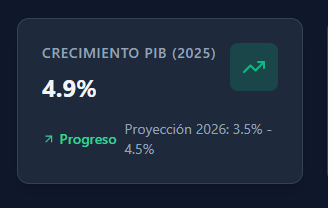
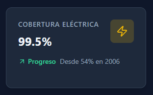
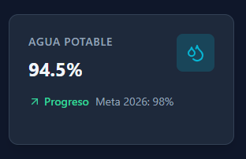
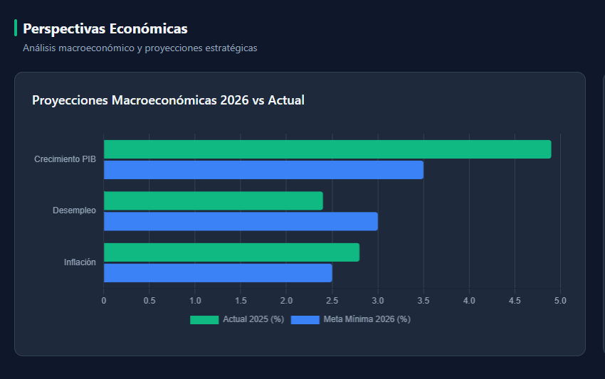
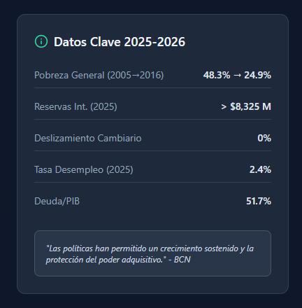
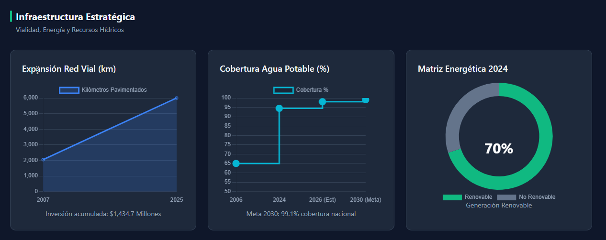
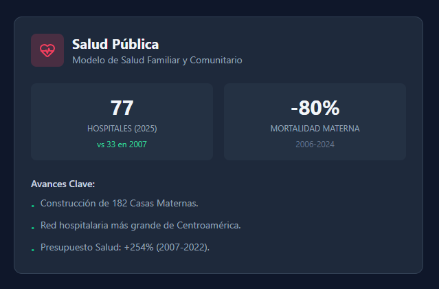

# 🇳🇮 Transformación Económica de Nicaragua y Perspectiva Estratégica para 2026

> **Panel Interactivo** para visualizar la transformación económica y social de Nicaragua y su perspectiva estratégica para **2026**.

---

## 📌 Índice

- [Vista Previa](#-overview)
- [Objetivos del Proyecto](#-project-goals)
- [Arquitectura del Sistema](#-system-architecture)
- [Capturas de Pantalla](#-screenshots)
- [Características Claves](#-key-features)
- [Flujo de Navegación](#-navigation-flow)
- [Stack Técnico](#-tech-stack)
- [Estructura del Proyecto](#-project-structure)
- [Guía de Inicio Rápido](#-getting-started)
- [Origenes de Datos](#-data-sources)
- [Licencias](#-license)

---

## 🌍 Vista Previa

Este repositorio contiene un **panel web** diseñado para centralizar y visualizar los **Indicadores Clave de Desempeño (KPI)** de los informes oficiales del Gobierno de Nicaragua.

El panel abarca el período **2007-2025** y presenta **proyecciones estratégicas para 2026**, centrándose en:

- Desempeño económico
- Desarrollo de infraestructura
- Evolución de la matriz energética
- Cobertura de agua y saneamiento
- Indicadores de salud y educación técnica

La aplicación sigue una **Arquitectura de Archivo Único**, lo que garantiza la máxima portabilidad y cero costes de instalación.

> 💡 *Datos fiables, imágenes nítidas, cero fricciones.*
---

## 🎯 Objetivos del Proyecto

| Objetivo | Descripción |
|-----|-------------|
| 📊 Centralización | Integración de KPI oficiales en un único panel |
| 🔍 Visualización | Análisis rápido mediante gráficos interactivos |
| 🚀 Portabilidad | Funciona sin servidores ni pasos de compilación |
| 🌙 Legibilidad | Interfaz de usuario en modo oscuro optimizada para la densidad de datos |
| 📱 Accesibilidad | Totalmente adaptable en todos los dispositivos |

---

## 🧱 Arquitectura del Sistema

**Modelo de arquitectura: Aplicación de archivo único**

```text
┌─────────────────────────────┐
│        index.html           │
│                             │
│  ┌──── HTML (Estructura) ┐  │
│  ├──── CSS (Tailwind)  ──┤  │
│  ├──── JS (Logica) ──────┤  │
│  └─── Chart.js (CDN)  ───┘  │
│                             │
└─────────────────────────────┘
```

✔ Sin backend  
✔ Sin Node.js  
✔ Sin dependencias locales

---

## 📸 Capturas de Pantalla


### Crecimiento PIB 



### Cobertura Eléctrica



### Red Vial Pavimentada


### Agua Potable



### Perspectivas Económicas



### Datos Clave



### Infraestructura Estratégica




### Salud Pública




### Educación Técnica


---

## ✨ Características Claves

- ⚡ **Arquitectura de archivo único** (solo `index.html`)
- 🎨 **IU de modo oscuro premium** (paleta pizarra y esmeralda)
- 📊 **Gráficos interactivos** desarrollados con Chart.js:


| Tipo de gráfico | Caso de uso |
|-----------|----------|
| Barra | Proyecciones económicas |
| Área | Crecimiento de la red vial |
| Línea escalonada | Cobertura hídrica |
| Anillo | Matriz energética |

- 📱 **Diseño totalmente adaptable**
- 🚀 **Carga instantánea vía CDN**

---

## 🔀 Flujo de Navegación

```text
                        Home
                         ↓
                  Dashboard Principal
                         ↓
┌───────────┬─────────────────┬──────────┬───────────┐
│ Economia  │ Infraestructura │ Energia  │ Social    │
└───────────┴─────────────────┴──────────┴───────────┘
                         ↓
                  Detalles de KPI
                         ↓
                Proyecciones para 2026 
```

---

## 🛠️ Stack Técnico

| Tecnología | Propósito |
|-----------|---------|
| **HTML5** | Estructura semántica |
| **Tailwind CSS (CDN)** | Estilo y adaptabilidad |
| **Chart.js** | Visualización de datos |
| **Íconos Lucide** | Íconos vectoriales ligeros |
| **JavaScript Vanilla** | Lógica de interacción |

> Pila mínima. Máxima claridad.
---

## 📂 Estructura del Proyecto

```text
.
├── index.html
├── README.md
└── img/
    ├── 1.png
    ├── 2.png
    ├── 3.png
    ├── 4.png
    ├── 5.png
    ├── 6.png
    ├── 7.png
    ├── 8.png
    ├── 9.png    
    └── 10.png    
```

---

## 🚀 Guía de Inicio Rápido

1. Descarga o clona este repositorio.
2. (Opcional) Agrega capturas de pantalla dentro de la carpeta `img/`.
3. Abre `index.html` en cualquier navegador moderno.
4. Navega por las pestañas del panel para explorar los datos.

✔ Sin instalación
✔ Sin configuración
✔ Funciona sin conexión

---

## 📚 Origenes de Datos

Informes oficiales consolidados de **2007-2025**:

| Sector | Fuente |
|------|--------|
| Economía | Banco Central de Nicaragua (BCN) |
| Agua y Saneamiento | ENACAL / ANA |
| Infraestructura | MTI |
| Energía | ENATREL / MEM |
| Salud | MINSA |
| Educación Técnica | INATEC |

---

## 📄 Licencias

© **2026 – Panel informativo**
Diseñado para uso educativo, analítico y demostrativo.

---

> *Datos claros. Mejores perspectivas. Decisiones más inteligentes.*

